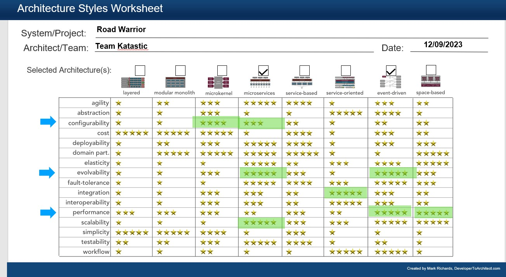

# Overall Architecture Style Analysis

## Identified Key Architectural Characteristics

The key architectural characteristics
- **Performance ^** 
- Cost 
- Scalability
- **Evolvability  ^**
- **Configurability  ^**
- Integration
- Fault Tolerance

## Architecture Capabilities Comparison

The above characteristics are highlighted in green in the workstyle sheet. 

Architecture Styles Worksheet

*Figure 1 Architecture Styles Worksheet*
#### Performance 
    Based on the nature of the starup and idea of servicing the customers better than current providers performance is a key and essential characteristic to be the diffrentiator 
#### Configurability
    Given the number of partners that need to be integrated to add value and coverage across region this is an critical characteristic for the architecture
#### Evolvability 
    Modularity: The system is divided into modular components, making it easier to modify or replace individual parts without affecting others.
    Loose Coupling: Components interact through well-defined interfaces, allowing for easier replacements or upgrades.
    Plug-and-Play Components: Design with a view to add new features or modules with minimal changes to existing code.
    Open Standards: Use of open standards and protocols to facilitate easier integration and future growth.

## Architecture Capabilities Analysis

The above matrix gives us two candidates for our architecture, which need further analysis:

### Microservices

| Pros                                                         | Cons                                                         | Mitigations                                                  |
| ------------------------------------------------------------ | ------------------------------------------------------------ | ------------------------------------------------------------ |
| Scores highly on elasticity and scalability, very important for analytics computation and media access. | Scores low on configurability and workflow, which would be a big trade-off with configurability being one of the top 3 characteristics. | Configurability is a concern, scoring low, but it is configurability of the profile that is important and not of the system as a whole. |
| Scores highly on fault-tolerance, important to make sure the community of Farmacy Family is not disrupted by a fault in one area. | Middling score on interoperability/integration, important because of integration with Farmacy Foods and other systems. | The middling interoperability ability can be mitigated by using an interface for integration with Farmacy Foods and other systems. |
|                                                              | Requires that the database be split along with each microservice. This would be very complex and another big trade-off. |                                                              |
|                                                              | Scores low on workflow, which would be a trade-off with workflow being important for onboarding of customers. |                                                              |
|                                                              | Also scores badly on cost and simplicity. Not key characteristics, but likely to be important to management and lead technologists respectively. |                                                              |

### Event-Driven

| Pros                                                         | Cons                                                         | Mitigations                                                  |
| ------------------------------------------------------------ | ------------------------------------------------------------ | ------------------------------------------------------------ |
| Scores highly on elasticity and scalability, very important for analytics computation and media access. | Interoperability and configurability score fairly low, which is a concern with them being two of the top three characteristics. | Configurability is a concern, scoring low, but it is configurability of the profile that is important and not of the system as a whole. |
| Scores highly on fault-tolerance, important to make sure the community of Farmacy Family is not disrupted by a fault in one area. | Middling score on interoperability/integration, important because of integration with Farmacy Foods and other systems. | The middling interoperability ability can be mitigated by using an interface for integration with Farmacy Foods and other systems. |
| Workflow scores highly, important for onboarding of customers. | scores badly on simplicity. Not a key characteristic, but likely to be important to lead technologists. |                                                              |

## Conclusion

Both architecture options have trade-offs, considering the startup core-team prior experience with microservices, team has decided to adopt microservices based architecture for all the services. 

Lack of experience and exposure to EDA and ecosystems was also discussed. Based on the growth and challages that may arise due to scale, EDA will be evalauted for adoption. 

### Decision

ADR: [002 Microservices-architecture VS Event-driven--architecture](../ADR/ADR01-Microservices-architecture.md)

